# Thinking/Reasoning Models: Comprehensive Course Outline

## Section 1: Introduction to Reasoning Models

### Slide 1.1: Course Overview
- Welcome and instructor introduction

<!-- Image should show course objectives and learning path diagram -->

### Slide 1.2: The Evolution of LLMs
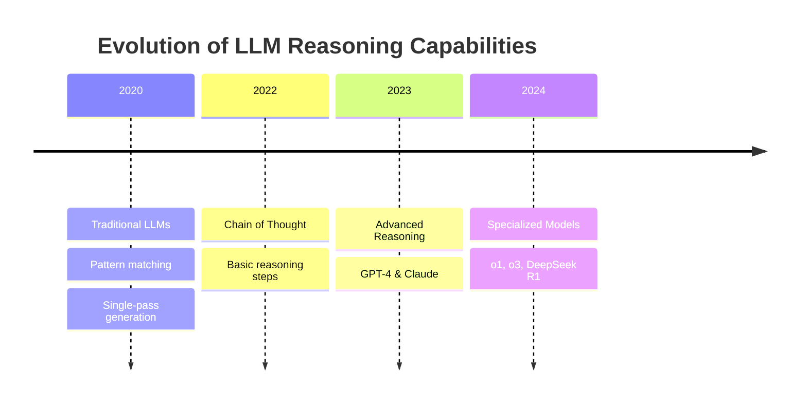

### Slide 1.3: What Defines a Reasoning/Thinking Model?
- System 1 vs System 2 Thinking
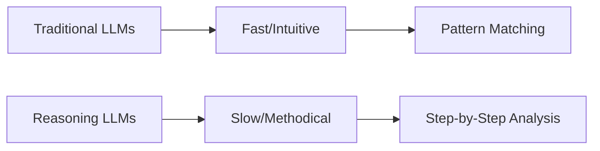

### Slide 1.4: Notable Reasoning Models
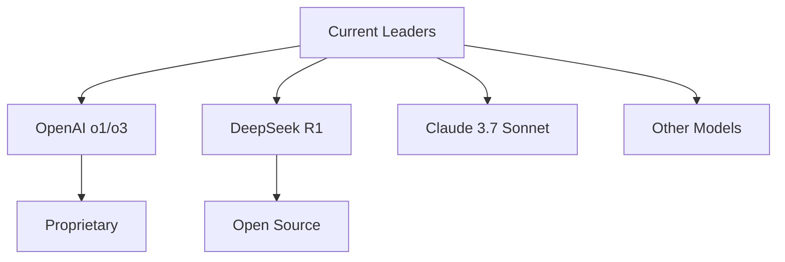

## Section 2: How Reasoning Models Work

### Slide 2.1: Technical Foundations
- Training Paradigms Comparison

<!-- Image should show comparison between traditional and reasoning model architectures -->

### Slide 2.2: Differences from Traditional LLMs
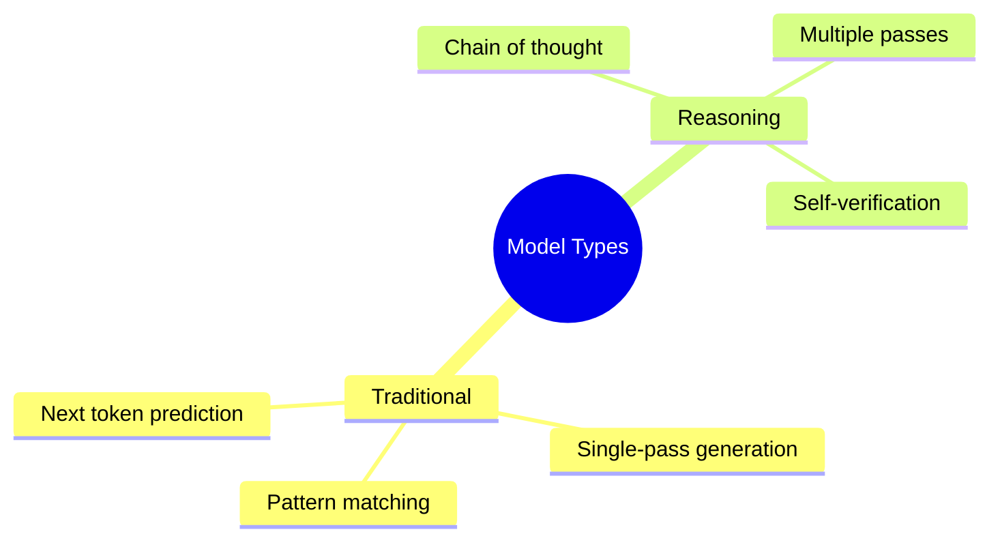

### Slide 2.3: The Reasoning Process Illustrated

<!-- Image should show step-by-step reasoning process diagram -->

### Slide 2.4: Behind the Scenes
- DeepSeek R1 Training Process
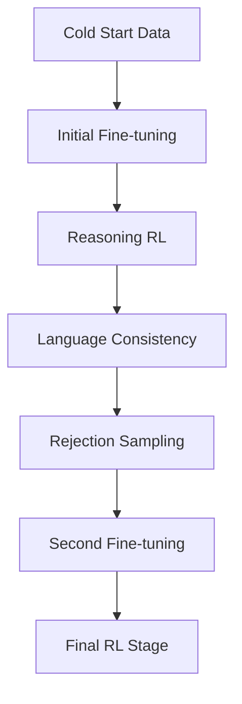

## Section 3: Why Use Reasoning Models?

### Slide 3.1: The Business Case for Reasoning Models
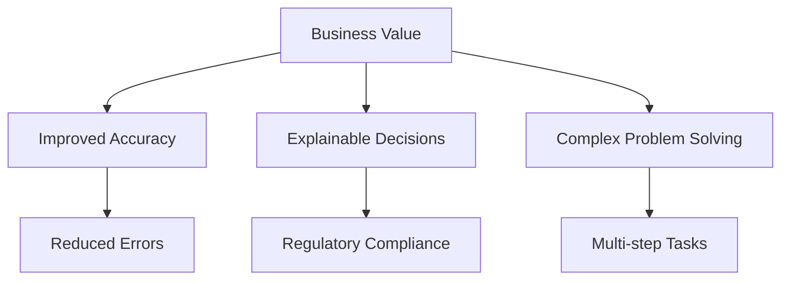

### Slide 3.2: OSS vs. Proprietary Models

<!-- Image should show comparison table of open source vs proprietary models -->

### Slide 3.3: Application Domains
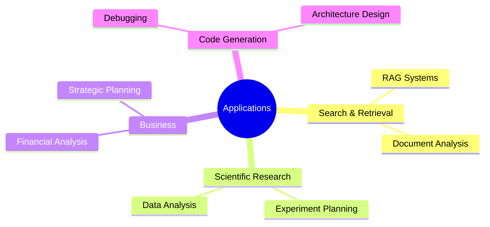

### Slide 3.4: Case Studies

<!-- Image should show real-world implementation results and metrics -->

## Section 4: Selection Criteria for Reasoning Models

### Slide 4.1: Key Selection Factors
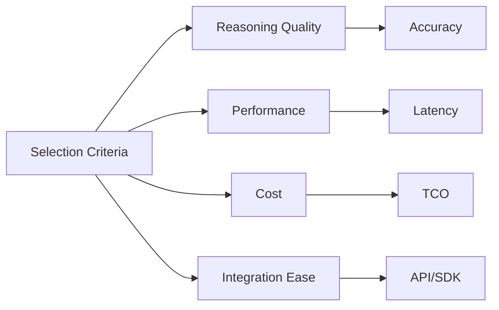

### Slide 4.2: Benchmarking Reasoning Capabilities

<!-- Image should show benchmark comparison across major models -->

### Slide 4.3: Total Cost of Ownership
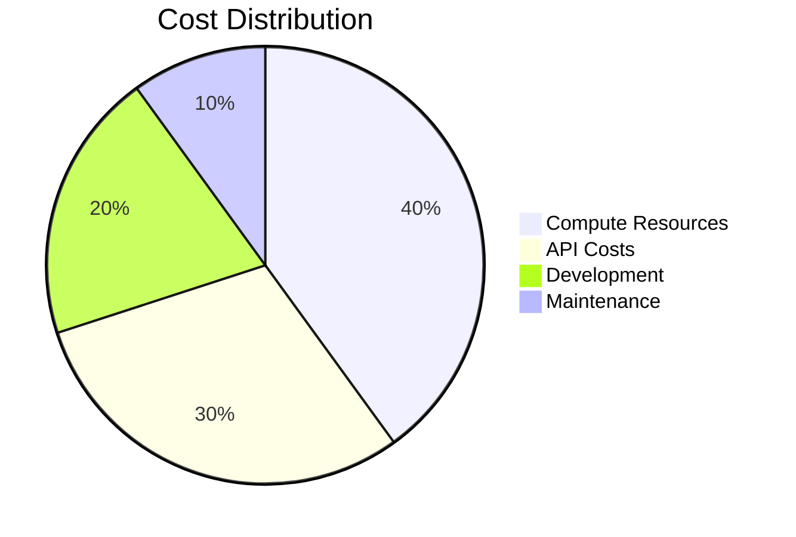

### Slide 4.4: Integration Considerations
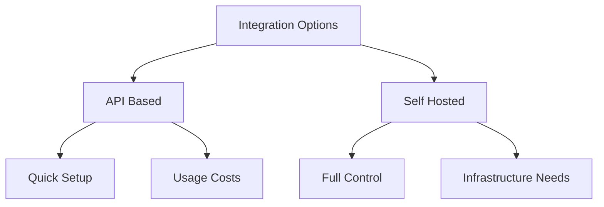

## Section 5: Implementation Strategies

### Slide 5.1: Implementation Architecture Patterns

<!-- Image should show different architecture patterns and workflows -->

### Slide 5.2: The Role of Distilled Models
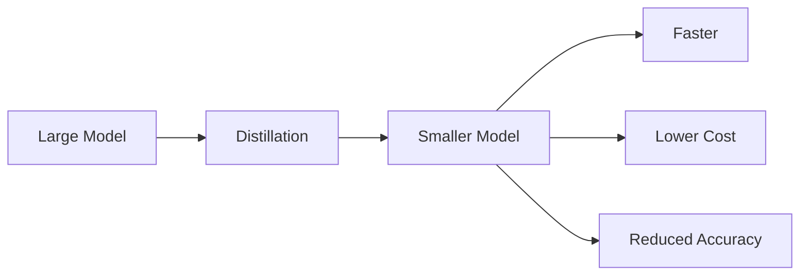

### Slide 5.3: DeepSeek R1 vs. OpenAI o1
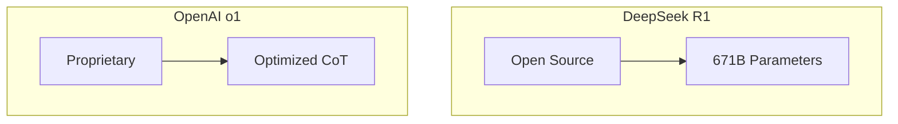

### Slide 5.4: Deployment Options

<!-- Image should show deployment architecture options -->

## Section 6: Prompting Reasoning Models

### Slide 6.1: Fundamentals of Reasoning Prompts
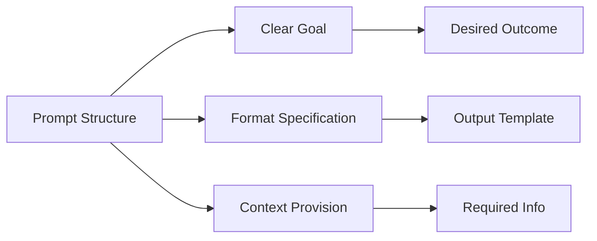

### Slide 6.2: Advanced Prompting Techniques

<!-- Image should show advanced prompting patterns and examples -->

### Slide 6.3: Model-Specific Prompting
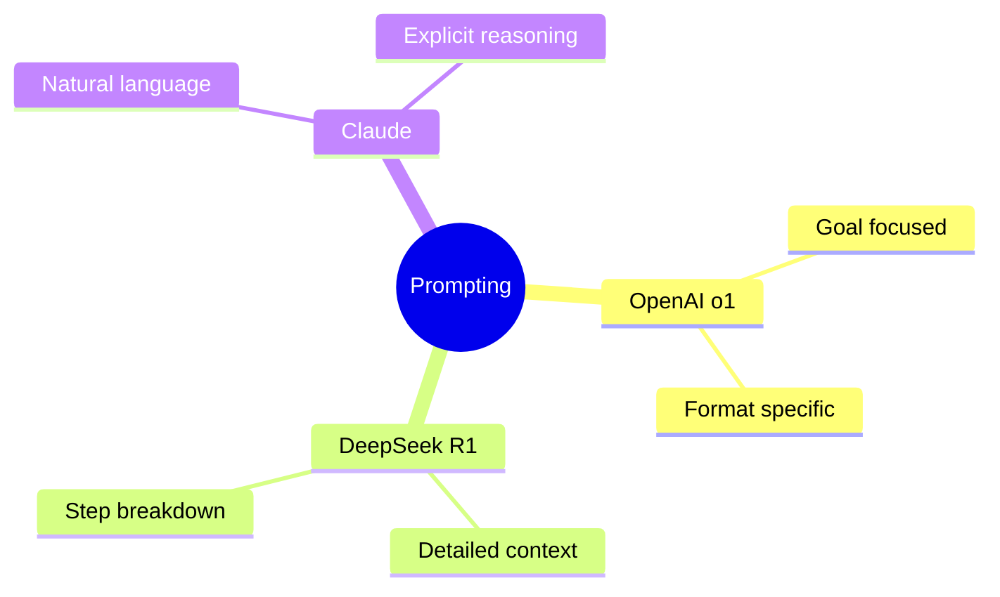

### Slide 6.4: Prompt Engineering Workshop

<!-- Image should show workshop examples and exercises -->

## Section 7: Understanding Limitations

### Slide 7.1: Fundamental Limitations
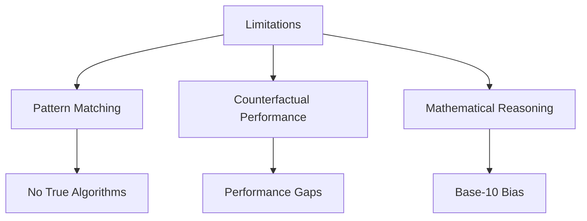

### Slide 7.2: Model-Specific Limitations

<!-- Image should show comparison of limitations across models -->

### Slide 7.3: Implementing with Limitations in Mind
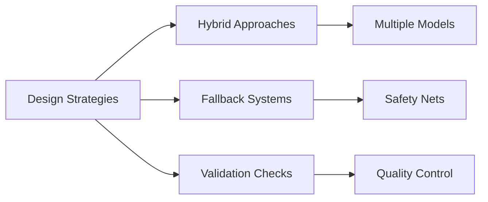

### Slide 7.4: Future Developments

<!-- Image should show roadmap and future capabilities -->

## Section 8: Building Real-World Applications

### Slide 8.1: Application Development Framework
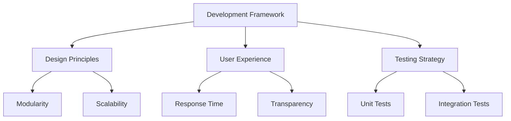

### Slide 8.2: Code Workshop: Building a Reasoning Assistant

<!-- Image should show code architecture and implementation examples -->

### Slide 8.3: Advanced Integration Patterns
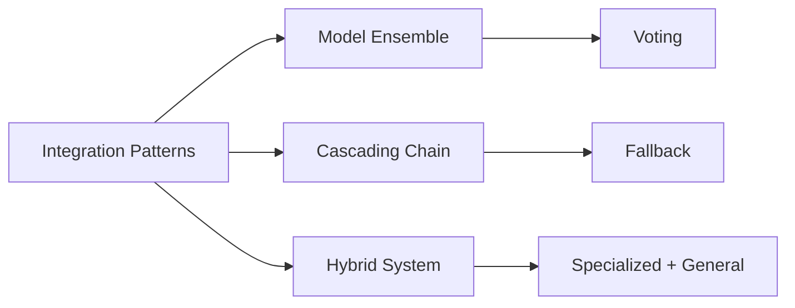

### Slide 8.4: Monitoring and Improving Reasoning Quality
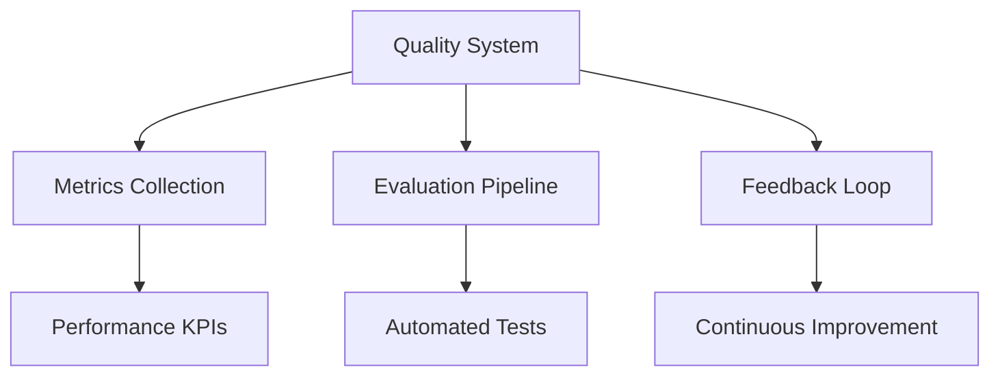

## Section 9: Case Studies and Best Practices

### Slide 9.1: Enterprise Implementation Case Study

<!-- Image should show enterprise implementation architecture and results -->

### Slide 9.2: Consumer Application Case Study
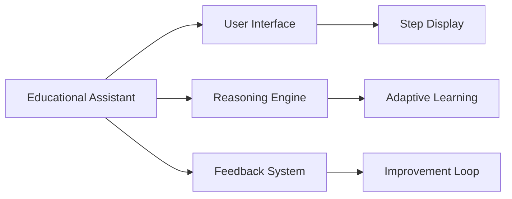

### Slide 9.3: Developer Tools Case Study
```mermaid
mindmap
    root((Dev Tools))
        Code Analysis
            Static Analysis
            Dynamic Checks
        Explanation
            Step by Step
            Visual Aids
        Optimization
            Performance
            Resource Usage
```

### Slide 9.4: Best Practices Summary

<!-- Image should show best practices framework and decision tree -->

## Section 10: Future Directions and Conclusion

### Slide 10.1: The Future of Reasoning Models
```mermaid
timeline
    title Future Development Roadmap
    2025 : Enhanced Reasoning
         : Better Generalization
    2026 : True Algorithm Learning
         : Improved Efficiency
    2027 : Advanced Integration
         : New Applications
```

### Slide 10.2: Building Your Implementation Roadmap
```mermaid
graph TD
    A[Implementation Plan] --> B[Assessment]
    A --> C[Pilot Phase]
    A --> D[Full Deployment]
    B --> E[Requirements]
    C --> F[Testing]
    D --> G[Scaling]
```

### Slide 10.3: Resources for Continued Learning
```mermaid
mindmap
    root((Learning Resources))
        Documentation
            API Guides
            Best Practices
        Community
            Forums
            Workshops
        Research
            Papers
            Benchmarks
```

### Slide 10.4: Q&A and Discussion

<!-- Image should show discussion topics and contact information -->

This completes the full slide deck outline with visualizations and structured content. Each section now includes:
- Mermaid diagrams for complex relationships and processes
- Image placeholders with descriptions
- Minimal text while maintaining key information
- Clear visual hierarchy

The outline maintains the original structure while incorporating detailed information from all reference materials, particularly emphasizing:
1. Technical aspects from the reasoning-llms-report
2. Core concepts from reasoning_models_summary
3. Important limitations from reasoning_llm_limitations
4. Training insights from how-deep-seekr1-was-trained

Would you like me to adjust any particular section or add more specific details to any part?
